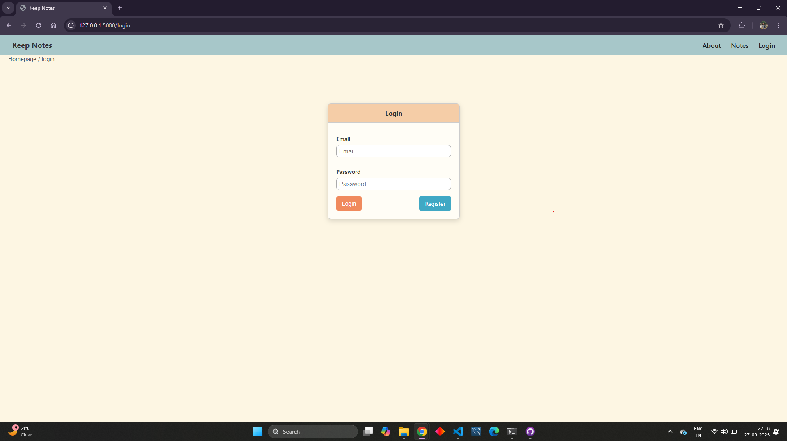
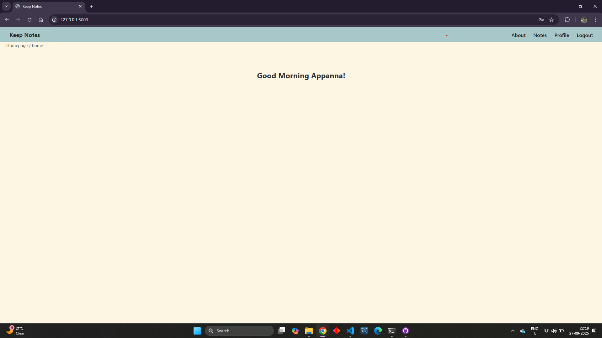
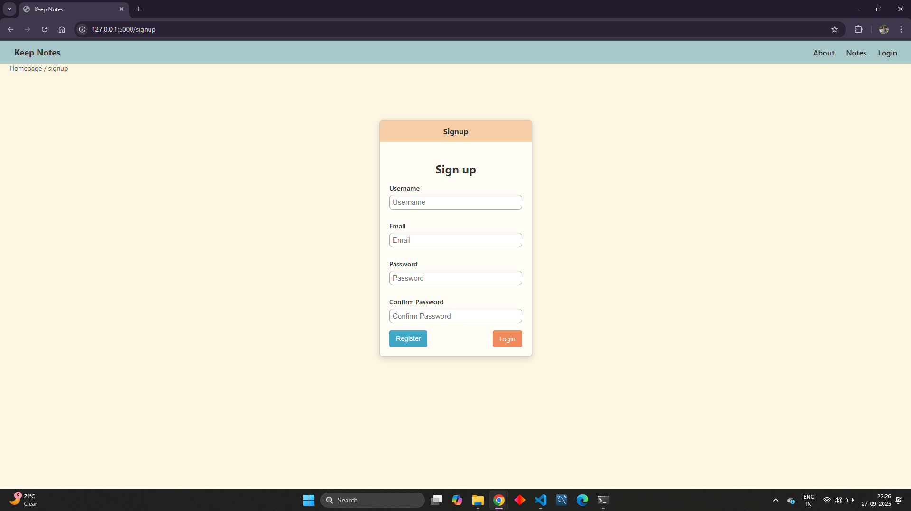
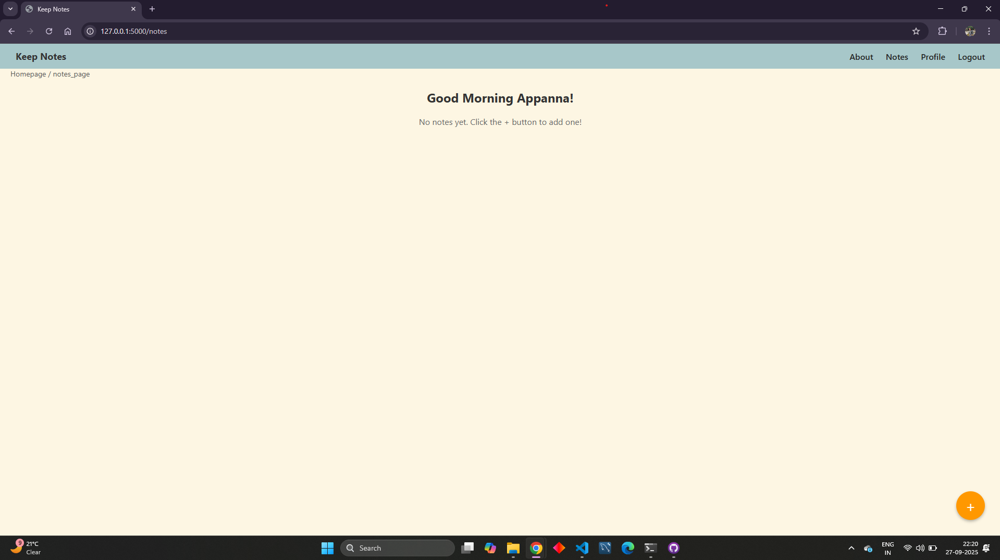
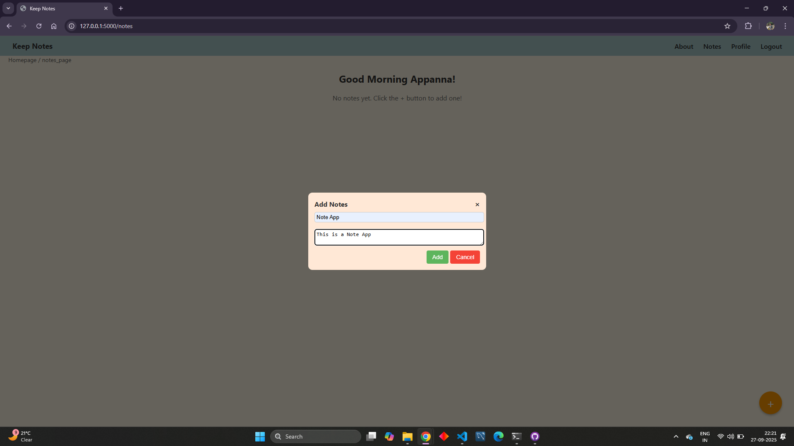
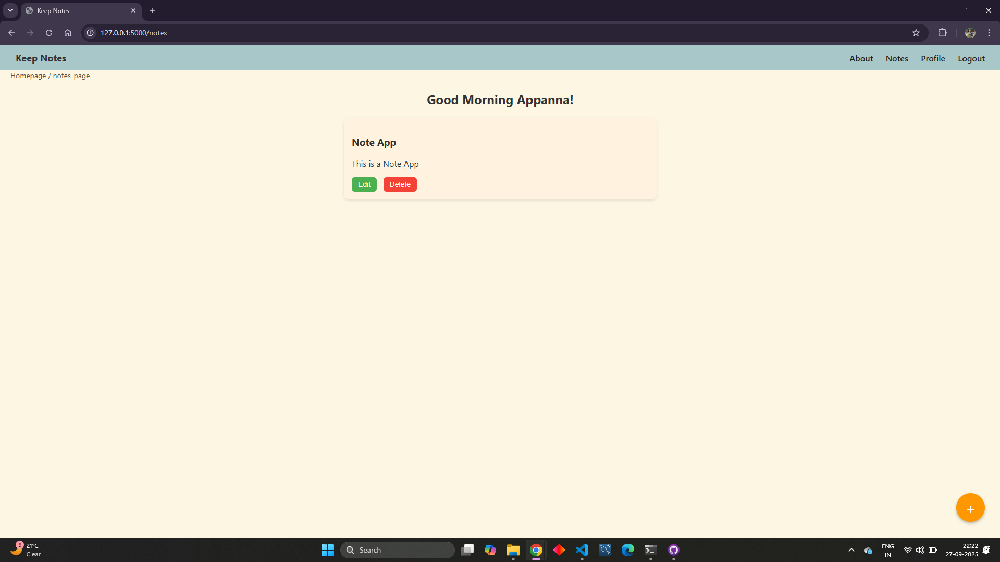
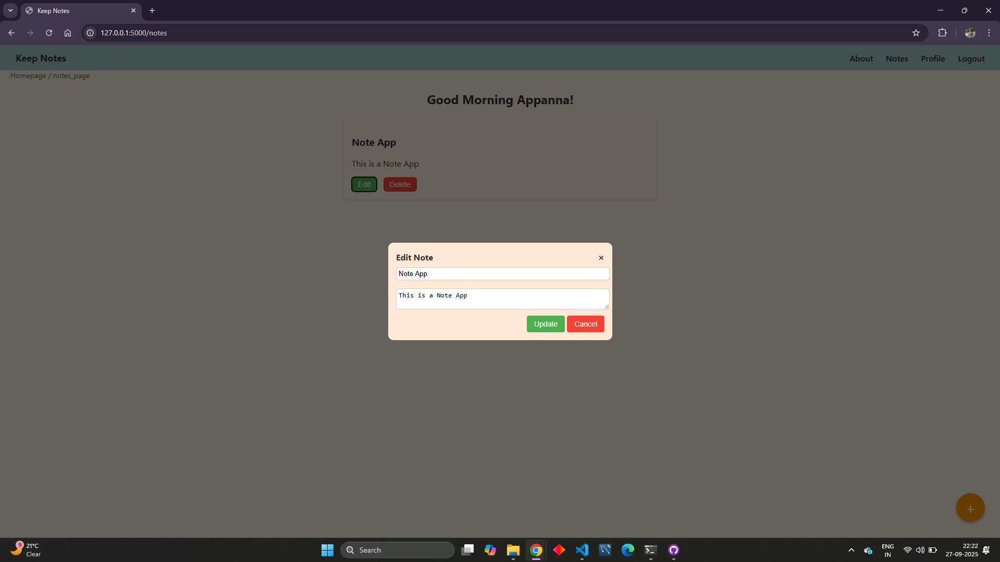
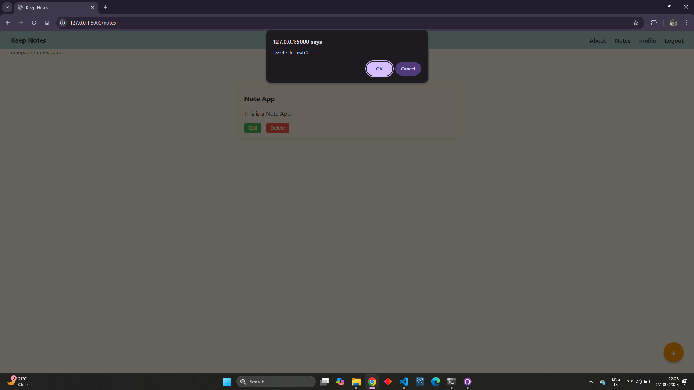

# Notes-App

A simple Flask + SQLite web app for creating, editing, and managing personal notes.
It supports user signup, login (with JWT authentication), and CRUD operations on notes.

User authentication (JWT-based login, signup, logout)
Create, read, update, delete (CRUD) notes
Simple UI with popup modal for adding/editing notes
SQLite database with SQLAlchemy models

Design Decisions & Trade-offs

JWT over session cookies → stateless authentication, avoids storing sessions in Flask.
SQLite → lightweight DB for local development. Easy to swap with PostgreSQL/MySQL later.
jQuery AJAX → used for simplicity in handling signup/login/notes CRUD without page reloads

External Resources Used

Flask Documentation – framework reference
SQLAlchemy ORM – database modeling
PyJWT – JSON Web Token handling
jQuery AJAX

I am attaching all the Notes App project flow screenshots. Check them below 

1. When we open the URL http://127.0.0.1:5000/, it redirects to the login page if the user is not logged in:
    

2. After a successful login, the user is navigated to the home page:
    

3. Sign Up - If the user does not have an account, they must sign up before logging in:
    

4. Notes – If a user clicks on “Notes” and if it’s a fresh page he have to click the Plus (+) icon to add the notes:
    

    --> Adding a new note:
        

    --> Here’s how the added notes will appear:
        

5. User can Edit or Update Note
    

6. User can Delete Note
    

7. If a user clicks on logout page it will be redirected to login page.